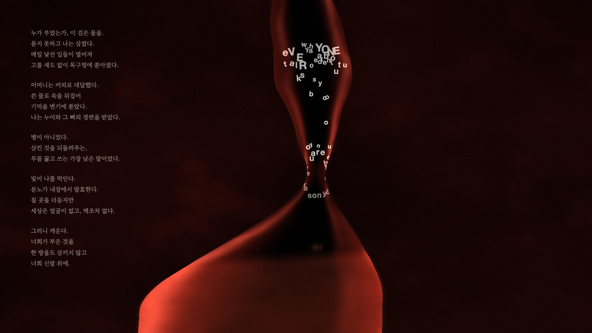
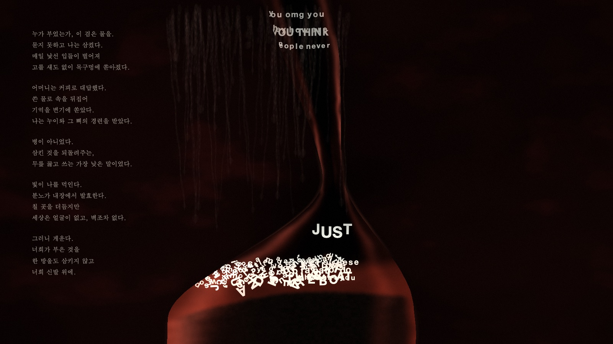

# 구토 (Vomit)

말을 먹는 몸. 인터넷에서 수확한 가해 발화를 삼키고, 삭이고, 삭지 못한 것을 게워내는 위장.

SCC Free Exhibition (2026.9.1–9.3, KAIST 산업디자인동) 설치작.

- **라이브**: https://indigestion.vercel.app — 화면을 한 번 누르면 전체화면·소리
- **제작기**: [따옴표 안에 사는 것](https://www.multi-turn.ai/blog/vomit)
- 보도자료·시 원문: [indigestion-press](https://github.com/hebo1221/indigestion-press)


이 작품에서 코드를 쓴 손은 AI(Claude)다. 사람은 시를 쓰고, 보고, 들었고, 퇴짜를 놓았다.
"구토가 시원찮다", "너무 방울같다", "문 닫는 소리가 난다" — 그 왕복이 아래 시스템의 절반이다.

---

## 시스템

```
┌─ 수확 ──────────────┐   ┌─ 선별 ──────────────┐   ┌─ 재생 ──────────────────────┐
│ src/harvest.ts       │   │ src/curate.ts        │   │ public/renderer.html         │
│ Playwright가 레딧    │   │ 겹따옴표 안쪽만 추출  │   │ 1,331줄 단일 파일, 의존성 0  │
│ 5개 게시판을 돌며    │──▶│ → LLM이 aim/venom    │──▶│ WebGL 몸 + 낱글자 물리       │
│ 스레드 73개 →        │   │   0~3 채점 → 73문장  │   │ + 절차 합성 사운드           │
│ 후보 1,876개         │   │ (링크는 버린다)       │   │ + 하루의 호(비가역)          │
└──────────────────────┘   └──────────────────────┘   └──────────────────────────────┘
```

전시장에서는 이 저장소의 `dist-web/`이 그대로 돌아간다. 서버도, 외부 CDN도, 오디오 파일도 없다.

### 1. 수확 — 잔인함이 사는 곳

처음 계획은 "험한 게시판의 댓글을 먹이자"였고, 실패했다. controversial 정렬로도, 다운보트
바닥까지 뒤져도 학대 피해자 커뮤니티의 댓글은 위로였다("God bless you"). 역겨운 말은 다른
곳에 살고 있었다 — **본문에, 증언 속에, 따옴표 안에**. 부모가 실제로 뱉은 말은 담담한 산문
한가운데 인용부호가 열리는 자리에서만 원래의 온도로 보존된다.

그래서 선별기는 겹따옴표 안쪽만 걷는다(`src/curate.ts`). 홑따옴표는 don't의 아포스트로피와
구분할 수 없어 걷지 않는데, 결과적으로 옳은 규칙이었다 — 영어 산문은 남의 말을 겹따옴표에
담는다. 추출된 후보는 LLM이 두 축으로 채점한다: `aim`(2인칭 겨냥 0–3), `venom`(잔인함 0–3).
슬러(비하어)와 실존 공인을 지목한 발화는 제외. **원문 링크는 저장하지 않는다** — 말뭉치에는
문장·aim·venom만 남는다(`dist-web/corpus.json`).

### 2. 몸 — 셰이더와 물리가 같은 해부학을 공유한다

프래그먼트 셰이더가 위장을 그린다: 비대칭 위(대만곡·소만곡의 반지름이 다르다), 연동파,
분문(食道-胃 경계)의 골, 출렁이는 산의 수면, 게움 때의 경련(heave). 핵심 설계는 **같은
SDF를 JS에도 복제**한 것 — 글자 물리가 셰이더가 그리는 바로 그 벽에 충돌한다. 보이는 몸과
부딪히는 몸이 하나다.

글자는 문장 단위로 삼켜져 식도를 내려가다 위에서 낱글자로 부서진다. 공간 해싱으로
글자끼리 충돌하고, 위산에 잠긴 시간만큼 삭는다 — 대문자가 소문자로, 소문자가 점으로.
**삭은 것은 게워지지 않는다**: 역류 때 위산에 오래 잠긴 글자일수록 저항이 커서, 거꾸로
올라가는 것은 아직 온전한 문장들뿐이다. 이 규칙은 시의 3연("삼킨 것을 되돌려주는")을
물리로 옮긴 것인데, 순서는 반대였다 — 규칙을 먼저 고쳤고, 시가 이미 그렇게 말하고
있었음을 나중에 확인했다.

끝까지 삭은 글자는 사라지지 않고 **앙금**이 된다. 96칸 높이장에 쌓여 1×96 텍스처로
셰이더에 넘어가고, 셰이더가 몸의 곡면 안쪽에만 그린다(캔버스 사각형으로 그리면 곡면을
따라가지 못해 검은 상자가 된다 — 그 버그의 교훈). 봉우리는 무너지고 가장자리는 벽을 타고
흘러내린다.



### 3. 하루 — 되돌아가는 것은 없다

이 화면의 시간 단위는 5분이 아니라 하루다(전시 9시–17시).

- `dayT = 1 − exp(−t/2.5h)` 가 하루의 깊이. 병은 깊어지기만 한다.
- 아침 몸은 삭인다. 저녁 몸은 삭이지 못한다 — 소화 속도 ×0.58, 게움 주기 ~100초 → ~51초.
- 호흡은 얕고 빨라지고(진폭 −42%, 주기 +42%), 위산은 탁해진다.
- 앙금은 8시간에 걸쳐 위를 채우고, 담을 자리가 줄어 게움이 잦아진다.
- 게워진 것은 화면 밖으로 사라지지 않는다. 유리 이쪽 면을 타고 흘러내려 마른 자국이 되고
  (하루 ~96개), 자국은 왼쪽의 시 위를 지나간다.

아침 9시에 온 사람과 오후 4시에 온 사람은 같은 작품을 보지 않는다. 같은 몸의 다른 시각을 본다.



### 4. 소리 — 구역감은 성대에 없다

오디오 파일이 하나도 없다. 전부 Web Audio 절차 합성이며, 몸의 상태 변수(breath, toxin,
purge, dayT)가 매 프레임 소리를 몬다.

| 켜 | 합성 |
|---|---|
| 숨 | 38/57.1 Hz 사인 2개 — 진폭·주기를 `breath`가 몰고, 저녁엔 얕고 빨라진다 |
| 창자 | 갈색 소음 → LP 90 Hz — 연동파와 같은 위상으로 웅얼거린다 |
| 삼킴 | "꿀"(하강 글라이드 285→120 Hz + 젖은 협대역 640→230 Hz) + "꺽"(후두 폐쇄 120→52 Hz) |
| 게움 | 5막: 헛구역질 수축 2–3회 → 조임(불규칙 계단) → **성문 폐쇄 75 ms 완전 정지** → 젖은 붕괴 + 빈 강(腔)의 공명 112 Hz → 웅덩이가 가라앉는 여운 |

게움 사운드는 네 판을 거쳤다: 노이즈 스위프(바람이지 구역질이 아니다) → 후두 통째 합성
(너무 사람이라 자극적) → 최종: 목소리를 걷어내고 **순서만** 남김. 구역감은 성대의 재현이
아니라 조임→정지→터짐의 압력 드라마에 있었다. 경련은 사인 트레몰로가 아니라 28–78 ms
불규칙 계단 게이팅이다 — 몸의 떨림에는 박자가 없다.

배운 규칙들: 갈색 소음은 상승 스위프에서 스스로 꺼진다(−6 dB/oct). `setValueAtTime(0)`으로
소리를 끝내면 클릭이 난다 — 항상 릴리즈를 준다. 빠른 어택의 순수 사인 단독은 나무 문
닫는 소리다 — 몸은 젖어 있으니 사인은 소음 아래 묻는다.

---

## 검증 — 눈 대신 계기

며칠을 눈으로 조율해도 못 잡던 문제를 계기가 한 번에 잡았다. 이 저장소의 `web/`에는
Playwright 기반 계측 스크립트가 렌더 코드보다 많다.

| 계기 | 잡은 것 |
|---|---|
| 글자 사인(死因) 분류 카운터 | **생성 599 · 게워짐 580 · 소화 0** — 몸이 먹는 족족 전부 토하고 있었다. 화면만 봐서는 끝내 몰랐을 것. 게움은 화려하니까 |
| 140 ms 간격 RMS 타임라인 | 게움 봉투의 실형(수축 0.028 → 절정 0.053 → 여운), 경련 AM이 수치로 보임 |
| 대역별 dB (FFT) | "삼킴이 안 들린다"의 진범 — 38 Hz 숨과 2 kHz 속삭임을 같은 RMS로 비교한 계측 착오. 대역을 갈라 재니 +38 dB 마진 |
| 내용 다양성 감사 | 40분 수확에 서로 다른 문장 3개(42회 되새김) — 물리 지표만 보고 내용을 안 센 대가 |
| 프로덕션 소크 | 119 fps 고정, JS 힙 2 MB 고정(누수 0), 콘솔 에러 0 |

측정이 가르쳐 준 것: 좁은 대역 과도음을 넓은 밴드 평균 dB로 재면 −100 dB로 보인다(370개
빈에 희석). 시뮬레이션이 소리를 낼 때는(v2, 충돌 발성) 쉬는 접촉이 초당 수천 번이라
문턱 없이는 스팸이 된다(충돌 세기 중앙값 0.001).

## 숫자

| | |
|---|---|
| 렌더러 | 1,331줄 단일 HTML, 외부 의존성 0 (WebGL1 + Canvas2D + Web Audio) |
| 성능 | 아침 121 fps / 저녁 80 fps(글자 366개) · 힙 2 MB 고정 |
| 말뭉치 | 스레드 73개 → 후보 1,876개 → 채택 73문장 |
| 게움 주기 | 아침 ~100 s → 저녁 ~51 s (dayT 연동) |
| 앙금 | 96칸 높이장, 8시간 포화 |
| 소리 | 오디오 파일 0개, 삼킴 소리 9종 구현(숫자키 1–9로 전환) |

## 실행

관람만 할 거면:

```sh
python3 -m http.server 8000 --directory dist-web
# http://localhost:8000 → 화면 한 번 클릭(전체화면+소리)
```

URL 다이얼 — 8시간을 기다리지 않고 몸의 상태를 본다:

| 파라미터 | 뜻 |
|---|---|
| `?aged=0..1&day=0..1` | 하루가 그만큼 지난 몸 (`?aged=1&day=1` = 저녁) |
| `?vol=0..1` | 볼륨 (0=무음) |
| `?snd=1..9` | 삼킴 소리 버전 (기본 3=꿀꺽; 1 속삭임 포먼트 · 2 활자 충돌 · 4 거꾸로 말 · 5 수화기 · 6 타자 · 7 구겨짐 · 8 몸북 · 9 모래) |
| `?dpr=0.75..2` | 해상도 (전시 하드웨어 성능 조절) |

수확·선별 파이프라인을 직접 돌리려면:

```sh
npm i                                     # playwright, tsx
echo "DEEPINFRA_API_KEY=..." > .env       # 선별 LLM용
npx tsx src/harvest.ts                    # → out/corpus-raw.jsonl
set -a && . ./.env && set +a
npx tsx src/curate.ts                     # → out/corpus.json
node web/build.mjs                        # → dist-web/
```

라이브 모드(전시 초기 버전 — 에이전트가 실시간으로 읽고 소화한다):
`npx tsx src/spike3-compositor.ts` (Playwright가 크롬을 몰고, ws://:4777로 렌더러에 상태를 쏜다).
전시 최종본은 안정성을 위해 미리 선별한 말뭉치 재생을 쓴다.

## 버전 고고학

`public/`에 렌더러의 지층이 남아 있다: `renderer-legacy.html`(브라우저 표시 시절) →
`renderer-v8-shapes.html`(브루탈리스트 근본도형) → `renderer.pre-organ.html` →
`renderer.pre-3d.html` → 현재. `explorations/`에는 장기(臟器) 형태 연구 A1→A7이 있다.

## 윤리

- 수집 대상은 공개 게시판의 공개 게시물이며, 그중에서도 **증언자가 이미 인용부호로 공개한
  가해자의 발화**만 먹는다. 증언자 본인의 서사는 먹지 않는다.
- 슬러(집단 비하어)와 실존 공인 지목 발화는 선별에서 제외한다.
- 말뭉치와 이 저장소에는 원문 링크·작성자 식별 정보를 저장하지 않는다.
- 화면에 뜨는 문장이 불편하다면, 그것이 이 작품이 하는 말이다 — 이 말들은 누군가가
  실제로 들은 말이다.

## 크레딧

- 시·개념·감독: 김정훈
- 코드·사운드: Claude (Anthropic) — 사람의 퇴짜를 먹으며
- 선별 LLM: DeepSeek-V4-Flash (DeepInfra)

코드는 MIT. 시·텍스트·이미지는 ⓒ 2026 김정훈, 별도 허가 없이 재사용 금지.
